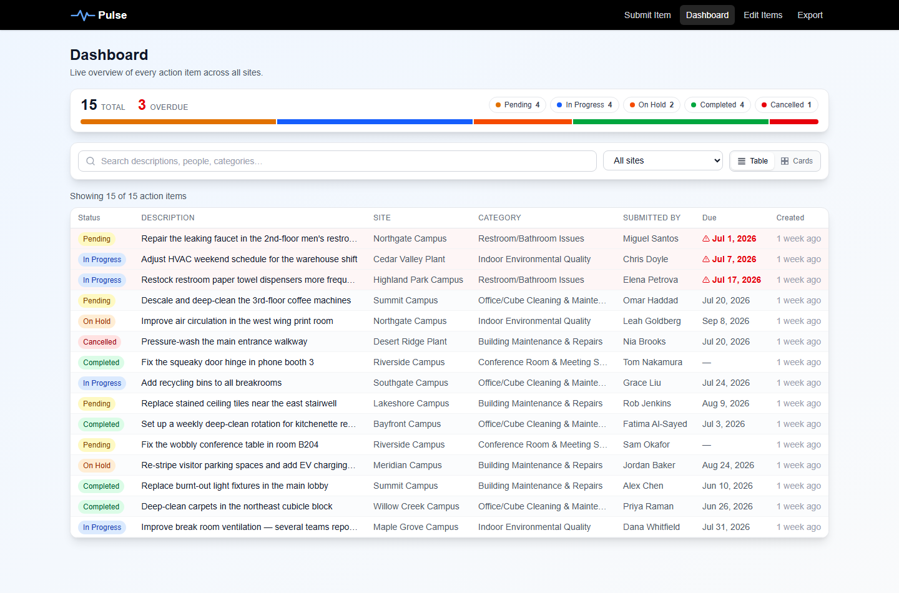
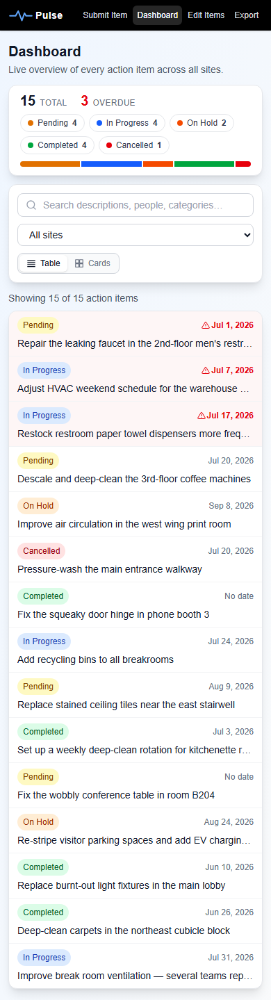
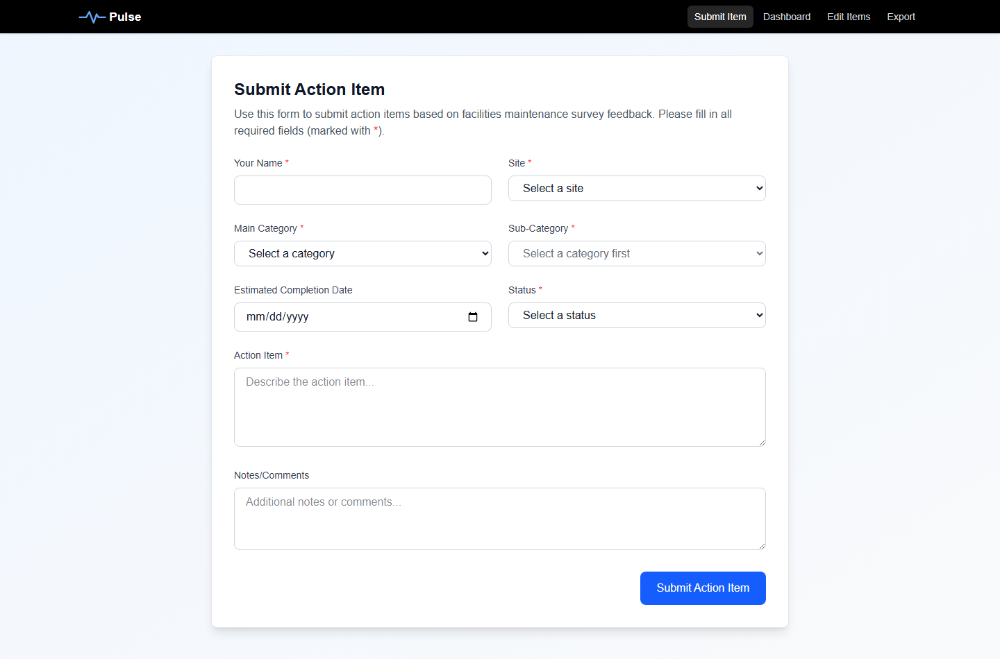

# Pulse — Survey Action Tracker

[](https://github.com/Phronesis2025/pulse-survey-actions/actions/workflows/ci.yml)

A full-stack Next.js + Supabase app for collecting and managing facilities action items from workplace pulse-survey feedback. It models a triage workflow: anyone — an employee, a visitor — submits feedback and browses live status, while a facilities/admin team triages each item (updating status, target dates, and details) and manages the lookup tables. Submitters intentionally don't edit their items after posting — it's a managed queue, not a wiki. Built as an engineering case study: this README documents not just *what* it does, but *why* it's built the way it is.

**Live demo:** https://pulse-survey-actions.vercel.app



<p>
  
  &nbsp;
  
</p>

## The app in one paragraph

Employees submit facilities issues ("Improve break room ventilation") through a public form. Each item carries a site, category → sub-category, status, optional target date, and notes. A dashboard shows the live picture — status distribution, overdue items surfaced first, filter/search across everything — in a dense sortable table or a card grid. The facilities/admin team triages items — updating status, dates, and details — and manages the lookup tables through secret-gated API routes; submitters don't edit their own items afterward. Data exports to Excel, and Power BI can connect straight to Postgres.

## Engineering case study

The project went through four deliberate phases, each a commit (or two) on `main`:

### 1. Correctness first

The revived codebase had a *vacuous* e2e edit test — it clicked through the UI but asserted nothing that could fail, and green tests that can't fail are worse than no tests. Rewriting it to verify persistence through the API exposed a real bug: the update path sent `""` for a cleared date into a Postgres `DATE` column. Fix: coerce empty strings to `null`, matching the create path.

### 2. Layered security

The app originally shipped allow-all RLS policies with the Supabase anon key exposed to the browser via `NEXT_PUBLIC_` env vars. The redesign enforces one rule at two layers, so a mistake in either is caught by the other:

- **API layer** — every destructive route calls `requireAdmin()` (`lib/admin.ts`): a constant-time comparison (`crypto.timingSafeEqual` over SHA-256 digests) of the `x-admin-secret` header against a server-only secret. Failures return an uninformative 401.
- **Database layer** — RLS policies (`supabase/migrations/002_harden_rls.sql`) allow anon exactly two things: `SELECT` everywhere and `INSERT` into `action_items`. Nothing else. Admin routes construct a per-request `service_role` client *after* the gate passes — never module-level, never shared with public code paths.
- **Key isolation** — all env vars are server-only (no `NEXT_PUBLIC_`); the browser never talks to Supabase. Verified by grepping client bundles for the key material after build.

Full model and threat notes: [SECURITY.md](SECURITY.md).

### 3. Product polish

A read-only dashboard (`/dashboard`) designed for density and hierarchy: a slim summary strip (totals, overdue count, clickable per-status filter pills, proportional distribution bar), then a compact sortable table where 15+ items fit one desktop screen. Overdue rows are tinted and flagged, rows expand inline for details, and a card-grid view sits behind a toggle persisted per tab. The status accent palette was validated programmatically for colorblind-safe adjacency and contrast rather than eyeballed, and every color is paired with a text label. Below `sm`, the table becomes a stacked list — no horizontal scrolling.

A seed script (`npm run seed`) creates ~15 realistic items **through the public API** — the same path real submissions take — so RLS, validation, and route logic get exercised on every re-seed. Overdue offsets are relative to run time, so the demo state stays interesting forever.

### 4. CI as a gate, not a decoration

Every push and PR to `main` runs typecheck, lint, build, and the full 13-test Playwright suite against a production server (`next start`, not the dev server). Vercel adds its own independent gate — it refuses to deploy Next.js versions with known critical CVEs, which is exactly how the 16.0.4 → 16.2.10 security upgrade got forced at ship time. Because e2e runs against a real shared database, the workflow uses a per-ref concurrency group so runs never overlap, and test cleanup is *loud*: a failed cleanup DELETE throws and fails the test rather than silently stranding rows. Test rows are registered for cleanup **before** creation and swept by name, so a test that dies mid-body still gets cleaned.

## Architecture

```
Browser ──── fetch ────► Next.js API routes ────► Supabase Postgres
   │                        │        │
   │  public: GET *, POST   │        └── anon client (RLS-constrained)
   │  action-items          │
   │                        └── admin: requireAdmin() gate, then
   │  admin: + x-admin-         per-request service-role client
   │  secret header             (bypasses RLS)
```

The browser never holds a database credential. The `/edit` page starts locked and read-only; the admin team unlocks editing through an in-page form that verifies the secret via `POST /api/admin/verify` before any edit controls appear. The verified secret is kept in `sessionStorage` (per tab) and sent as a header on mutations — a convenience, not a security boundary. The server-side gate on every mutating route stays authoritative.

## Tech stack

Next.js 16.2 (App Router, TypeScript, Turbopack) · Supabase Postgres with RLS · Tailwind CSS 4 · Playwright · GitHub Actions · Vercel

## Getting started

```bash
npm install
```

1. Create a [Supabase](https://supabase.com) project (free tier works).
2. In the SQL Editor, run `supabase/migrations/001_initial_schema.sql` (tables + dropdown data), then `supabase/migrations/002_harden_rls.sql` (locked-down policies).
3. Copy `.env.example` to `.env.local` and fill in the values (Supabase → Settings → API):

| Variable                    | Description                             | Sensitivity                                 |
| --------------------------- | --------------------------------------- | ------------------------------------------- |
| `SUPABASE_URL`              | Project URL                             | Low, but server-only anyway                 |
| `SUPABASE_ANON_KEY`         | Anon key                                | Constrained by RLS (read + submit only)     |
| `SUPABASE_SERVICE_ROLE_KEY` | Service-role key for admin routes       | **Secret — bypasses RLS entirely**          |
| `ADMIN_SECRET`              | Shared secret gating destructive routes | **Secret — grants edit/delete via the API** |

4. Run it:

```bash
npm run dev        # http://localhost:3000
npm run seed       # optional: 15 realistic sample items via the public API
```

The app fails at startup with a clear message if the Supabase URL or anon key is missing or still a placeholder.

## Testing

```bash
npm run test:e2e       # 13 Playwright tests
npm run test:e2e:ui    # interactive mode
```

The suite covers submission, the admin-gated edit flow (the admin secret is read from `.env.local` and injected into `sessionStorage`), export, and navigation. Row-creating tests clean up after themselves through the admin DELETE route and fail loudly if cleanup doesn't stick.

## CI

`.github/workflows/ci.yml` runs on every push/PR to `main`: `npm ci` → `tsc --noEmit` → lint → `next build` → Playwright (chromium) against the production build. Four repository secrets are required: `SUPABASE_URL`, `SUPABASE_ANON_KEY`, `SUPABASE_SERVICE_ROLE_KEY`, `ADMIN_SECRET`. On failure, the Playwright HTML report is uploaded as an artifact (7-day retention).

## Admin operations

There is no admin UI for lookup tables by design (see tradeoffs). Manage them via the API with the secret:

```powershell
curl -X POST https://pulse-survey-actions.vercel.app/api/sites `
  -H "Content-Type: application/json" `
  -H "x-admin-secret: your_admin_secret" `
  -d '{"name": "New Site"}'
```

Same pattern for `PUT`/`DELETE` on `/api/sites/[id]`, `/api/categories`, `/api/sub-categories`, and `/api/statuses`. Editing action items has a UI at `/edit`: the page is read-only until the admin team enters the secret in the in-page unlock (verified up front via `POST /api/admin/verify`), which then persists per tab in `sessionStorage`.

## Power BI

Connect Power BI Desktop directly to the Supabase Postgres instance (**Get Data → PostgreSQL**, host `db.<project-ref>.supabase.co`, database `postgres`, port `5432`) and join `action_items` against the four lookup tables:

```sql
SELECT ai.user_name, s.name AS site, c.name AS category, sc.name AS sub_category,
       ai.action_item, ai.estimated_completion_date, st.name AS status,
       ai.notes, ai.created_at, ai.updated_at
FROM action_items ai
LEFT JOIN sites s ON ai.site_id = s.id
LEFT JOIN categories c ON ai.category_id = c.id
LEFT JOIN sub_categories sc ON ai.sub_category_id = sc.id
LEFT JOIN statuses st ON ai.status_id = st.id
ORDER BY ai.created_at DESC;
```

## Deployment

Import the repo in [Vercel](https://vercel.com), add the same four environment variables in project settings, deploy. Free tiers of Vercel and Supabase are sufficient.

## Known tradeoffs (accepted deliberately)

- **One shared admin secret, no user accounts** — a deliberately right-sized stand-in for a demo/portfolio app. A production enterprise deployment would use identity-based auth instead: SSO/OIDC (e.g. Entra ID), role-based access for the facilities/admin team, per-user audit trails, and session expiry. What would *not* change is the structure — the layered API-gate + RLS design is the production-realistic part; real auth would only swap the gate's credential check (shared secret → verified identity/role), leaving the data layer and RLS untouched.
- **In-page unlock over `sessionStorage`** — the `/edit` page is read-only until the admin secret is entered in an in-page form (verified via `POST /api/admin/verify`); the secret then lives in `sessionStorage` per tab. Crude by design, matching the shared-secret model above — the server-side gate stays the only real enforcement point.
- **No assignee column** — items carry the submitter (`user_name`); assignment context lives in notes. Adding a column is a small migration if the need becomes real.
- **CI hits the real demo database** — mitigated by per-ref concurrency, unique test-row names, and fail-loud cleanup rather than a second database.

## License

Open source, for educational purposes.
